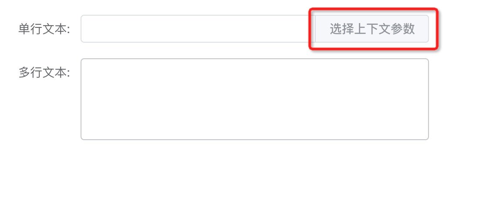

# vue-form-create-auto-ops

基于 [vue-form-create](https://github.com/fuchengwei/vue-form-create) 修改。

在输入框后面添加了上下文参数按钮，用于选择上下文参数和其他与输入框相关的事件。



```vue
<template>
  <!-- <ElDesignForm /> -->
  <ElGenerateForm
    :data="dataJson"
    :value="valueJson"
    @handleSelectParam="handleSelectParam"
  />
</template>
```

```js
const handleSelectParam = (val: any) => {
  console.log('handleSelectParam', toRaw(val))
  // { label: "单行文本", type: "input", model: "input_733a3709e38f481aa36a1ec73cfa4a77"}
}
```
